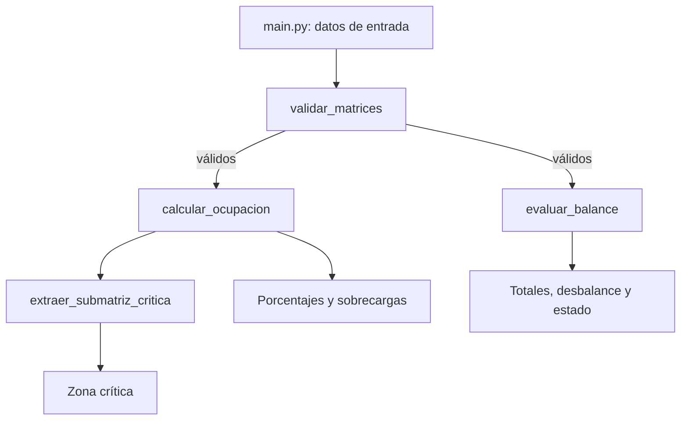

# AeroCargo-Matrix
## Datos del estudiante

**Nombre:** Jaime Fernando Portillo Linares  
**Carnet:** PL231163
Solución del Examen Teórico Unidad II de **Desarrollo de Algoritmos para la Simulación de Sistemas (DAS172)**.

## Explicación del problema

La distribución de masa influye directamente en la seguridad de una aeronave. Cada zona del piso de carga posee una capacidad máxima: superarla puede producir esfuerzos estructurales no permitidos. Además, una diferencia excesiva entre la carga del lado izquierdo (babor) y el derecho (estribor) altera la simetría lateral y puede afectar la estabilidad y el control. El sistema representa la bahía como una matriz, compara cada peso real con su capacidad, calcula los totales longitudinales por fila y verifica el desbalance lateral contra una tolerancia operativa.

## Arquitectura modular



Las funciones se encuentran en `aerocargo.py`; reciben todos sus datos por parámetros, retornan resultados nuevos y no usan variables globales ni alteran las matrices recibidas. `main.py` coordina el flujo y presenta los resultados. `test_aerocargo.py` comprueba casos típicos y de borde.

## Contratos de las funciones

- `validar_matrices(cargas, capacidades) -> bool`: comprueba tamaño mínimo 2 x 2, regularidad, dimensiones idénticas, pesos no negativos y capacidades positivas.
- `calcular_ocupacion(cargas, capacidades) -> (matriz, coordenadas)`: aplica `(peso/capacidad)*100` y registra las celdas mayores a 100 %. Las coordenadas usan índices desde cero.
- `evaluar_balance(cargas, tolerancia) -> (totales_fila, desbalance, aprobado)`: suma cada fila y compara las mitades laterales. Si hay un número impar de columnas, omite la central. El límite es inclusivo: un desbalance igual a la tolerancia queda aprobado.
- `extraer_submatriz_critica(porcentajes, k, p, criterio) -> matriz`: recorre todas las ventanas contiguas. `promedio` maximiza la ocupación media; `sobrecargas` maximiza la cantidad de celdas mayores a 100 % y usa el promedio como desempate.

## Complejidad computacional

Sea una matriz de `N` filas y `M` columnas:

- La validación, ocupación y evaluación del balance recorren cada celda una vez: tiempo **O(N x M)**.
- La matriz de porcentajes ocupa **O(N x M)**; las listas auxiliares ocupan como máximo el mismo orden, por lo que la memoria total es **O(N x M)**.
- Para una ventana fija `k x p`, la extracción revisa `(N-k+1)(M-p+1)` posiciones y examina `k x p` celdas por posición: **O((N-k+1)(M-p+1)kp)**. Si `k` y `p` son constantes operativas, se simplifica a **O(N x M)**. La copia de la ventana ganadora ocupa **O(k x p)**.

## Ejecución

Requiere Python 3.9 o posterior y no utiliza paquetes externos.

```bash
python main.py
python -m unittest -v
```

## Casos especiales cubiertos

- Matrices mínimas 2 x 2, dimensiones distintas y filas irregulares.
- Pesos en cero, pesos negativos y capacidades en cero.
- Columnas pares e impares; en el segundo caso se omite la columna central.
- Celdas exactamente al 100 % (no se consideran sobrecarga).
- Ventanas que no caben en la matriz y tolerancias inválidas.
- Comprobación de que las entradas permanecen sin cambios.

## Historial de commits sugerido

El requisito de cinco commits debe realizarse de manera auténtica y progresiva al trabajar en GitHub. Secuencia recomendada:

1. `docs: crear estructura inicial y explicar el problema`
2. `feat: agregar validación de matrices`
3. `feat: calcular ocupación y detectar sobrecargas`
4. `feat: evaluar balance y extraer zona crítica`
5. `test: agregar pruebas unitarias y demostración completa`

## Estructura

```text
das172-examen2-hernandez-nelson/
├── aerocargo.py
├── main.py
├── test_aerocargo.py
├── README.md
└── .gitignore
```
